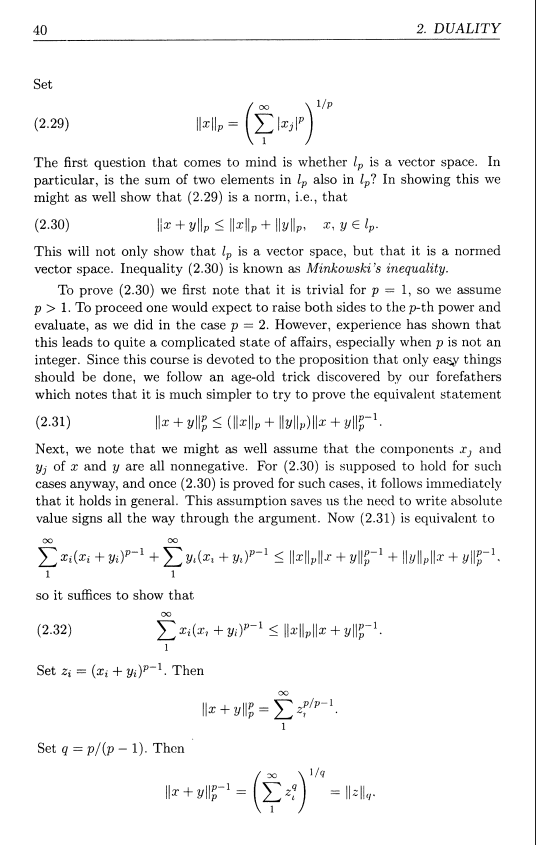
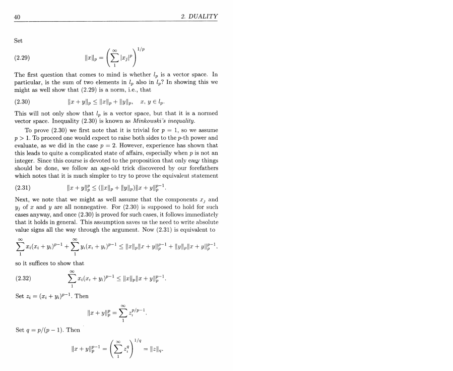

# add PDF margins
This repository contains the script for adding margins to a PDF file.
## Motivation
The way I study textbooks and such is by downloading the PDF file, adding a right margin, and actively working along with the material in the right margin. For smaller PDF files, it is much simpler to look up websites that does it for you. For larger PDF files, they require you to spend money and that is where the problem arises. Hence, I created my own script for adding margins to a PDF file.
## Method
The method used for creating margins is turning each page  into images and adding the image to a page with larger dimensions, adjusting to margin sizes. This is the only method I've came up with so far that can preserve  much of the content from the original PDF file. It'd be difficult to parse the content and preserve its structure, especially PDF files with LaTeX. Note that this is just a band-aid solution and if there's a better method feel free to contribute!
## Requirements
- Python >= 3.10
## Installation 
1. Clone the repository to your local machine
```bash
git clone https://github.com/edwin1in/add-pdf-margin.git
```
2. Install dependencies
```bash
pip install -r /path/to/requirements.txt
```
3. Install poppler

**Windows**

Windows users will have to build or download poppler for Windows. I recommend [@oschwartz10612 version](https://github.com/oschwartz10612/poppler-windows/releases/) which is the most up-to-date. You will then have to add the bin/ folder to [PATH](https://www.architectryan.com/2018/03/17/add-to-the-path-on-windows-10/). Adding the path to poppler in the script is not supported.

**Mac**

Mac users will have to install [poppler](https://poppler.freedesktop.org/).

Installing using [Brew](https://brew.sh/):
```bash
brew install poppler
```

**Linux**

Most distros ship with `pdftoppm` and `pdftocairo`. If they are not installed, refer to your package manager to install `poppler-utils`.

**Platform-independent** ( Using `conda`)

>1. Install poppler: `conda install -c conda-forge poppler`

>2. Install pdf2image: `pip install pdf2image`

## Usage
Run the script without any arguments to launch the GUI:
```bash
python main.py 
```
To run without the GUI:
```bash
python main.py --path="path/to/file.pdf" [OPTIONS]
```
## Command-line Options
| Option | Description | Default |
|--------|-------------|---------|
| `-h`, `--help` | Show the help message and exit. | - |
| `--path PATH` | Path to the input PDF file. **Required** when running in CLI mode. | - |
| `--lmargin LMARGIN` | Set the left margin size. | `0` |
| `--rmargin RMARGIN` | Set the right margin size. | `0` |
| `--tmargin TMARGIN` | Set the top margin size. | `0` |
| `--bmargin BMARGIN` | Set the bottom margin size. | `0` |
| `--unit {px,in,cm,mm}` | Unit used for all margin values. | `px` |
| `--output OUTPUT` | Name or path of the output PDF file. If omitted, the original PDF file is overwritten. | Original file |


## Example

The following example uses a page from *Martin Schechter – Principles of Functional Analysis (Second Edition)*.

**Original**



Run the following command to add a 10-inch right margin:

```bash
python main.py --path="path/to/file.pdf" --rmargin=10 --unit=in
```

**Output**

